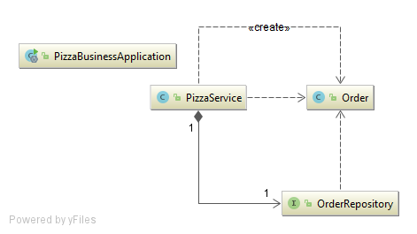
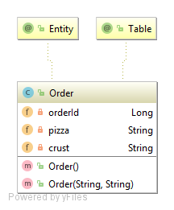
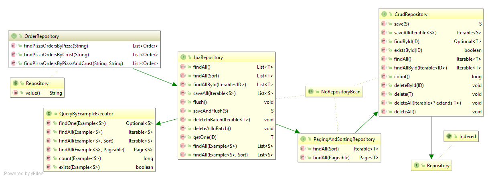
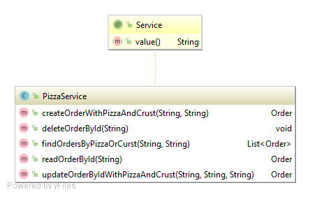
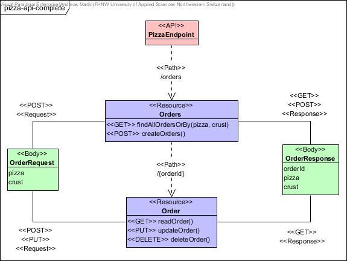
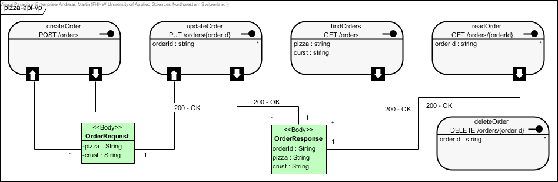
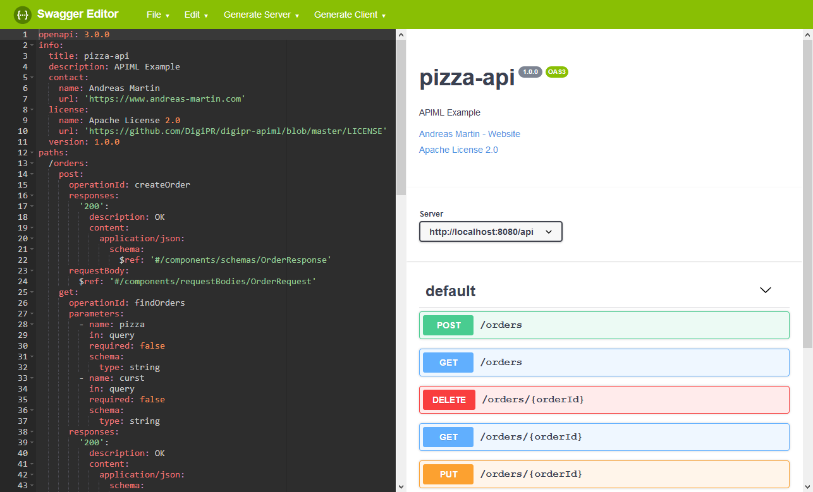
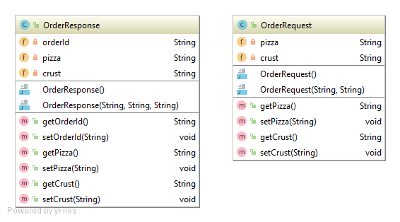
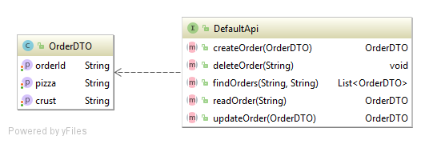
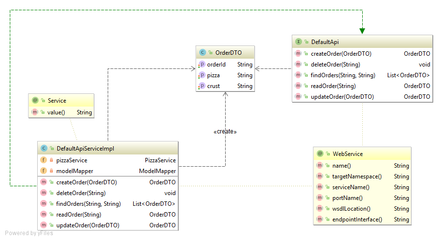

# DigiPR Pizza API Example

This example illustrates how an API can be implemented based on JAX-RS and JAX-WS with the help of Apache CXF, the Spring framework, Netflix Eureka and Swagger/OpenAPI.

#### Contents:
- [Analysis](#analysis)
- [Design](#design)
    - [Architecture](#architecture)
    - [Artefacts and Packages](#artefacts-and-packages)
- [Business Layer](#business-layer)
    - [Bootstrapping](#bootstrapping)
    - [Implementation](#implementation)
- [1. REST API](#1-rest-api)
    - [API Design](#api-design)
    - [Model-first OpenAPI / Swagger](#model-first-openapi--swagger)
    - [JAX-RS Endpoint](#jax-rs-endpoint)
    - [Spring RESTTemplate Client](#spring-resttemplate-client)
- [2. SOAP Web Service](#2-soap-web-service)
    - [Interface Design](#interface-design)
    - [JAX-WS Endpoint](#jax-ws-endpoint)
    - [CXF Web Service Client](#cxf-web-service-client)
- [3. Service Registry](#3-service-registry)
    - [Architecture](#architecture-1)
    - [Eureka Server](#eureka-server)
    - [Self-registering JAX-RS Endpoint](#self-registering-jax-rs-endpoint)
    - [Spring RESTTemplate Client with Eureka](#spring-resttemplate-client-with-eureka)
    - [Links:](#links)

## Analysis

This exemplary API is part of pizza order management system. The API can be used by a client, where it can create and manage pizza orders as described in the following **Use Case**:

- UC-1 [Manage Orders]: An API client can create, find, update and delete pizza orders.

## Design

This exemplary microservice as part of the pizza order management system provides a minimal and basic API as defined in the previous use case model.

### Architecture
This API relies on a two-layer architecture comprising of business (logic) and data access (sometimes called persistence) layer combined as business layer, and a implementation specific service layer. Since the database is seldom considered as belonging to the same tier, it is sometimes not disclosed on a layer.

### Artefacts and Packages

## Business Layer

The business layer is comprising of business logic and data access layer combined into one artefact. This means this artefact will be reused in all the API / service examples and included as Maven dependency.

> Please note, that the business layer is usually separated into a business (logic) and data access (sometimes called persistence) layer. In this case the business (logic) layer is not providing the domain model (entity objects) to the consuming layer to avoid layer bridging. Instead, the entities will be mapped to data transfer objects (DTOs).

In this case, the entity objects will be forwarded to the upper-layers - the service layers.

### Bootstrapping

The project can be bootstrapped using the [Spring Initializr](https://start.spring.io) using the following group and artefact ids:

```XML
<groupId>rocks.process.pizza</groupId>
<artifactId>pizza-business</artifactId>
```

Besides, in the [Spring Initializr](https://start.spring.io) just select `JPA` and the `H2` support - in the following you can find the Maven dependencies if Spring Initializr is not used:

```XML
<dependency>
    <groupId>org.springframework.boot</groupId>
    <artifactId>spring-boot-starter-data-jpa</artifactId>
</dependency>

<dependency>
    <groupId>com.h2database</groupId>
    <artifactId>h2</artifactId>
    <scope>runtime</scope>
</dependency>
```

Finally, generate and import the project into your favourite IDE.

### Implementation

As depicted in the following, this business layer consists of `PizzaService` to manipulate an `Order` entity with the help of the `OrderRepository`:



#### Domain Model (Entities)

This small example only contains one domain object / entity, the `Order`, which is implemented as follows using [Java Persistence API (JPA)](http://www.oracle.com/technetwork/java/javaee/tech/persistence-jsp-140049.html) and [Spring Data](https://projects.spring.io/spring-data):



> Please note, that `Order` is a `SQL` keyword. Therefore, the entity `Order` is annotated with `@Table(name = "PIZZA_ORDER")` to avoid `SQL` conflicts.

#### Data Access Objects (Repositories)

[Spring Data](https://projects.spring.io/spring-data) is providing an interface, annotations and methods to access the data in CRUD (create, read, update and delete) style (see Spring Data classes in the diagram below):
- `JpaRepository` provides JPA related methods such as CRUD functions.
- `@Repository` tells spring data that it will auto-generate the implementation based on class name provided.
- `find...` defines a query from the provided method name extension.

Besides the boilerplate / standard functionality of Spring Data, the `OrderRepository` contains three methods to retrieve orders:



#### Business Logic (Services)

The business logic layer contains one basic `PizzaService` for managing the pizza orders:



#### Maven Artefact

Once the business layer has been implemented as described above, the artefact then can be compiled (`mvn:compile`) and installed (`mvn:install`) in the local Maven repository. Finally, the `pizza-business` artefact can be re-used in the service layers as follows:

```XML
<dependency>
    <groupId>rocks.process.pizza</groupId>
    <artifactId>pizza-business</artifactId>
    <version>0.0.1-SNAPSHOT</version>
</dependency>
```

## 1. REST API

The first implementation example is a JAX-RS-based REST API (`pizza-api-jaxrs`) and a corresponding client (`pizza-client-rest`).

### API Design

The API has been modelled using the [APIML](https://github.com/DigiPR/digipr-apiml) UML variant as follows:



> A stereotype configuration for Visual Paradigm can be downloaded form here: [https://github.com/DigiPR/digipr-apiml](https://github.com/DigiPR/digipr-apiml)

Visual Paradigm provides an own specific modelling variant for REST APIs as follows:



Finally, Visual Paradigm allows the generation of OpenAPI / Swagger configuration files.

### Model-first OpenAPI / Swagger

The following screen-shot shows the API definition in the [Swagger Editor](https://editor.swagger.io):



Import and edit the pizza-API .yaml files:
- [Swagger 2.0](https://raw.githubusercontent.com/DigiPR/digipr-apiml/master/swagger-2.0/pizza-api-swagger.yaml)
- [OpenAPI 3.0](https://raw.githubusercontent.com/DigiPR/digipr-apiml/master/openapi-3.0/pizza-api-openapi.yaml)

### JAX-RS Endpoint

In the following a pizza API microservice will be creating using [Spring Boot](https://projects.spring.io/spring-boot) and [Apache CXF](http://cxf.apache.org/) based on the [JAX-RS](https://github.com/jax-rs) (Java API for RESTful Web Services) specification.

#### Bootstrapping

The project can be bootstrapped using the [Spring Initializr](https://start.spring.io) using the following group and artefact ids:

```XML
<groupId>rocks.process.pizza</groupId>
<artifactId>pizza-api-jaxrs</artifactId>
```

In the [Spring Initializr](https://start.spring.io) select `Apache CXF (JAX-RS)` support, and generate and import the project into your favourite IDE.

Then modify the Maven `pom.xml` import the following dependencies, besides `cxf-spring-boot-starter-jaxrs`:

```XML
<dependency>
    <groupId>org.apache.cxf</groupId>
    <artifactId>cxf-spring-boot-starter-jaxrs</artifactId>
    <version>3.2.5</version>
</dependency>

<dependency>
    <groupId>org.apache.cxf</groupId>
    <artifactId>cxf-rt-rs-service-description-swagger</artifactId>
    <version>3.2.5</version>
</dependency>

<dependency>
    <groupId>org.webjars</groupId>
    <artifactId>swagger-ui</artifactId>
    <version>3.19.0</version>
</dependency>

<dependency>
    <groupId>com.fasterxml.jackson.jaxrs</groupId>
    <artifactId>jackson-jaxrs-json-provider</artifactId>
    <version>2.9.7</version>
</dependency>

<dependency>
    <groupId>rocks.process.pizza</groupId>
    <artifactId>pizza-business</artifactId>
    <version>0.0.1-SNAPSHOT</version>
</dependency>
```

- `cxf-rt-rs-service-description-swagger` provides the Swagger annotation support for API documentation.
- `swagger-ui` enables the Swagger web interface.
- `jackson-jaxrs-json-provider` enables the Java object to JSON transformation using Jackson.
- `pizza-business` is the business layer.

#### Configuration

This REST API microservice will listen on port `8081` and will scan for jaxrs / cxf components, as defined in the `application.yml`:

```yaml
server:
    port: 8081
cxf:
    path: /api
    jaxrs:
        component-scan: true
        classes-scan-packages: org.apache.cxf.jaxrs.swagger
```

The Swagger UI can be configured further (optional) using a `swagger.properties` file in the `src\main\resources` folder:

```properties
title = pizza-api
description = APIML Example.
version = 1.0.0
```

Finally, we define the JSON provider `@Bean` in a `@Configuration` class in the package `rocks.process.pizza.config`:

```Java
@Configuration
public class ProvidersConfig {

	@Bean
	@ConditionalOnMissingBean
	public JacksonJsonProvider jsonProvider() {
		return new JacksonJsonProvider();
	}
}
```

#### Generated Code

As described in the [Model-first OpenAPI / Swagger](#model-first-openapi--swagger) section above, we can use a Swagger / OpenAPI yaml-based API description to generate an API - meaning generating server code.

When using the [Swagger Editor](https://editor.swagger.io) it is possible to generate client sources (`Generate Client`) for Apache CXF (`jaxrs-cxf`).

The generated code can be imported into your application:
1. Under `rocks.process.pizza.model` import the transfer models `OrderRequest` and `OrderResponse`.
2. Under `rocks.process.pizza.api` import the main API definition interface `DefaultApi`.
3. Finally, under `rocks.process.pizza.api.impl` import the interface implementation stub `DefaultApiServiceImpl`.

> Please note that, you may have to organize the imports, since the generated code has it's own package structure.

#### Implementation

Please investigate the generated interface called `DefaultApi`: 

```Java
@Path("/")
public interface DefaultApi {

    @POST
    @Path("/orders")
    @Consumes({"application/json"})
    @Produces({"application/json"})
    public OrderResponse createOrder(@Valid OrderRequest orderrequest);

    @DELETE
    @Path("/orders/{orderId}")
    public void deleteOrder(@PathParam("orderId") String orderId);

    @GET
    @Path("/orders")
    @Produces({"application/json"})
    public List<OrderResponse> findOrders(@QueryParam("pizza") String pizza, @QueryParam("curst") String curst);

    @GET
    @Path("/orders/{orderId}")
    @Produces({"application/json"})
    public OrderResponse readOrder(@PathParam("orderId") String orderId);

    @PUT
    @Path("/orders/{orderId}")
    @Consumes({"application/json"})
    @Produces({"application/json"})
    public OrderResponse updateOrder(@PathParam("orderId") String orderId, @Valid OrderRequest orderrequest);
}
```

This interface contains the JAX-RS annotations for defining a REST API:

- With `@Path` it is possible to define the path for all and/or specific methods of an interface.
- In conjunction with `@PathParam` the `@Path` can contain path parameters such as ids.
- The HTTP methods are expressed by `@GET`, `@PUT`, `@POST` and `@DELETE` method annotations.
- Finally, with `@Consumes` and `@Produces` it can be in which 'format' the API certain data can be consumed and produced.

Please investigate the generated implementation class called `DefaultApiServiceImpl`: 

```Java
@Component
public class DefaultApiServiceImpl implements DefaultApi {

    @Autowired
    private PizzaService pizzaService;

    public OrderResponse createOrder(OrderRequest orderrequest) {
        // ...
    }

    public void deleteOrder(String orderId) {
        // ...
    }

    public List<OrderResponse> findOrders(String pizza, String curst) {
        // ...
    }

    public OrderResponse readOrder(String orderId) {
        // ...
    }

    public OrderResponse updateOrder(String orderId, OrderRequest orderrequest) {
        // ...
    }
}
```

Finally, use the `pizzaService` from the business layer to implement the method stubs above.

#### Deployment

Once the REST API has been implemented as described above, the server can be booted, investigated and tested using the following URLs:

- API URL: [http://localhost:8081/api](http://localhost:8081/api)
- Swagger UI: [http://localhost:8081/api/api-docs?url=/api/swagger.json](http://localhost:8081/api/api-docs?url=/api/swagger.json)
- Swagger JSON: [http://localhost:8081/api/swagger.json](http://localhost:8081/api/swagger.json)
- WADL: [http://localhost:8080/api/?_wadl](http://localhost:8080/api/?_wadl)

### Spring RESTTemplate Client

To consume the REST API, the RESTTemplate client functionality of the Spring framework is used.

#### Bootstrapping

The project can be bootstrapped using the [Spring Initializr](https://start.spring.io) using the following group and artefact ids:

```XML
<groupId>rocks.process.pizza</groupId>
<artifactId>pizza-client-rest</artifactId>
```

Besides, in the [Spring Initializr](https://start.spring.io) just select `Spring Web` support - in the following you can find the Maven dependencies if Spring Initializr is not used:

```XML
<dependency>
    <groupId>org.springframework.boot</groupId>
    <artifactId>spring-boot-starter-web</artifactId>
</dependency>
```

Finally, generate and import the project into your favourite IDE.

#### Configuration

This microservice client will listen on port `8080` and will use the pizza-api URL as defined in the `application.yml`:

```yaml
server:
  port: 8080

pizza-api:
  url: http://localhost:8081/api
```

Finally, we define RestTEmplate as `@Bean` in a `@Configuration` class in the package `rocks.process.pizza.config`:

```Java
@Configuration
public class WebServiceConfig {

    @Bean
    public RestTemplate restTemplate() {
        return new RestTemplate();
    }
}
```

#### Implementation

Firstly, it is advisable to define in the package `rocks.process.pizza.model` data transfer models als Java classes to share the data with the REST API:



Finally, inspect the following demonstrative implementation of a REST API client:
```Java
@RestController
public class DefaultAPIConsumer {

    private static Logger logger = LoggerFactory.getLogger(DefaultAPIConsumer.class);

    @Value("${pizza-api.url}")
    private String pizzaAPIURL;

    @Autowired
    private RestTemplate restTemplate;

    @RequestMapping(value = "/test", method = RequestMethod.GET)
    private void testPizzaOrder()
    {
        OrderRequest orderRequest = new OrderRequest("REST", "lean");
        OrderResponse orderResponse = restTemplate.postForObject(pizzaAPIURL + "/orders", new HttpEntity<>(orderRequest), OrderResponse.class);
        logger.info("Order created with orderId: " + orderResponse.getOrderId() + ".");

        List<OrderResponse> orderResponses = restTemplate.exchange(pizzaAPIURL + "/orders" + "?pizza=REST", HttpMethod.GET, null, new ParameterizedTypeReference<List<OrderResponse>>(){}).getBody();
        logger.info("Order list received with size: " + orderResponses.size() + ".");

        orderRequest.setCrust("update");
        restTemplate.put(pizzaAPIURL + "/orders/" + orderResponse.getOrderId(), new HttpEntity<>(orderRequest));

        orderResponse = restTemplate.getForObject(pizzaAPIURL + "/orders/" + orderResponse.getOrderId(), OrderResponse.class);
        logger.info("Order updated and retrieved with crust: " + orderResponse.getCrust() + ".");

        restTemplate.delete(pizzaAPIURL + "/orders/" + orderResponse.getOrderId());

        orderResponses = restTemplate.exchange(pizzaAPIURL + "/orders", HttpMethod.GET, null, new ParameterizedTypeReference<List<OrderResponse>>(){}).getBody();
        logger.info("Order deleted and list received with size: " + orderResponses.size() + ".");
    }
}
```

#### Deployment

Once the REST API client has been implemented as described above, the server can be booted, investigated and tested using the following URL:

- REST API client test URL: [http://localhost:8080/test](http://localhost:8080/test)

> Consult the server console / logs to investigate the logging information concerning the API client.

## 2. SOAP Web Service

The second implementation example is a JAX-WS-based SOAP Web Service (`pizza-api-jaxws`) and a corresponding client (`pizza-client-jaxws`).

### Interface Design

With JAX-WS the interface can be designed in straight forward way by defining or using a plain Java interface, in this case `DefaultAPI`, and preferably some data transfer objects (DTOs), which is in this case called `OrderDTO`.



> Please note that this example is reflecting a code-first approach.

### JAX-WS Endpoint

In the following a pizza JAX-WS endpoint will be creating using [Spring Boot](https://projects.spring.io/spring-boot) and [Apache CXF](http://cxf.apache.org/) based on the [JAX-WS](https://javaee.github.io/metro-jax-ws/) (Java API for XML Web Services) specification.

#### Bootstrapping

The project can be bootstrapped using the [Spring Initializr](https://start.spring.io) using the following group and artefact ids:

```XML
<groupId>rocks.process.pizza</groupId>
<artifactId>pizza-api-jaxws</artifactId>
```

Use the [Spring Initializr](https://start.spring.io) and generate and import the project into your favourite IDE.

Then modify the Maven `pom.xml` import the following dependencies:

```XML
<dependency>
    <groupId>org.apache.cxf</groupId>
    <artifactId>cxf-spring-boot-starter-jaxws</artifactId>
    <version>3.2.5</version>
</dependency>

<dependency>
    <groupId>org.modelmapper</groupId>
    <artifactId>modelmapper</artifactId>
    <version>2.3.0</version>
</dependency>

<dependency>
    <groupId>rocks.process.pizza</groupId>
    <artifactId>pizza-business</artifactId>
    <version>0.0.1-SNAPSHOT</version>
</dependency>
```

- `cxf-spring-boot-starter-jaxws` provides the Apache CXF JAX-WS support.
- `modelmapper` enables an model-to-model mapping support.
- `pizza-business` is the business layer.

#### Initial-Configuration

This SOA microservice will listen on port `8082` and register the jaxws / cxf components, as defined in the `application.yml`:

```yaml
server:
  port: 8082
cxf:
  path: /api
```

If you have a layered enterprise architecture you end up with similar but different object models. Object mapping converts one model to another in a generic way. This is especially the case when having data transfer objects (DTOs) to avoid layer bridging.

In this example, we are using the [ModelMapper](http://modelmapper.org) library, which needs to be configured using `ProvidersConfig` in the package `rocks.process.pizza.config` as follows:

```Java
@Configuration
public class ProvidersConfig {

	@Bean
	@ConditionalOnMissingBean
	public ModelMapper modelMapper() {
		return new ModelMapper();
	}
}
```

#### Implementation

At the first stage create the `OrderDTO` class (including getter/setter) in the package `rocks.process.pizza.model` as depicted here:



Then define the `DefaultAPI` in package `rocks.process.pizza.api` as follows:

```Java
@WebService
public interface DefaultApi {

    @WebMethod
    public OrderDTO createOrder(OrderDTO orderDTO);

    @WebMethod
    public void deleteOrder(String orderId);

    @WebMethod
    public List<OrderDTO> findOrders(String pizza, String curst);

    @WebMethod
    public OrderDTO readOrder(String orderId);

    @WebMethod
    public OrderDTO updateOrder(OrderDTO orderDTO);
}
```

In this interface use the JAX-WS annotations for defining a SOAP Web Service:

- With `@WebService` it is possible to define an interface to be a Endpoint and enable the WSDL generation.
- With `@WebMethod` it is possible to include a method in the WSDL.

Based on the `DefaultApi` SOAP Web Service definition above, an implementing class `DefaultApiServiceImpl` can be implemented in the package `rocks.process.pizza.api.impl` as follows in conjunction with the the [ModelMapper](http://modelmapper.org) library:

```Java
@Service
@WebService(endpointInterface = "rocks.process.pizza.api.DefaultApi")
public class DefaultApiServiceImpl implements DefaultApi {

    @Autowired
    private PizzaService pizzaService;

    @Autowired
    private ModelMapper modelMapper;

    @Override
    public OrderDTO createOrder(OrderDTO orderDTO) {
        Order order = pizzaService.createOrderWithPizzaAndCrust(orderDTO.getPizza(), orderDTO.getCrust());
        modelMapper.map(order, orderDTO);
        return orderDTO;
    }

    public void deleteOrder(String orderId) {
        pizzaService.deleteOrderById(orderId);
    }

    public List<OrderDTO> findOrders(String pizza, String curst) {
        List<Order> orders = pizzaService.findOrdersByPizzaOrCurst(pizza, curst);
        Type orderTypeList = new TypeToken<List<OrderDTO>>() {}.getType();
        return modelMapper.map(orders, orderTypeList);
    }

    public OrderDTO readOrder(String orderId) {
        Order order = pizzaService.readOrderById(orderId);
        OrderDTO orderDTO = new OrderDTO();
        modelMapper.map(order, orderDTO);
        return orderDTO;
    }

    @Override
    public OrderDTO updateOrder(OrderDTO orderDTO) {
        Order order = pizzaService.updateOrderByIdWithPizzaAndCrust(orderDTO.getOrderId(), orderDTO.getPizza(), orderDTO.getCrust());
        modelMapper.map(order, orderDTO);
        return orderDTO;
    }
}
```

#### Initial-Configuration

The registration of the implementation classes can be done by injecting / registering them in a `WebServiceConfig` in the package `rocks.process.pizza.config` as follows:

```Java
@Configuration
public class WebServiceConfig {

    @Autowired
    private Bus bus;

    @Autowired
    private DefaultApiServiceImpl defaultApiService;

    @Bean
    public Endpoint endpoint() {
        EndpointImpl endpoint = new EndpointImpl(bus, defaultApiService);
        endpoint.publish("/orders");
        return endpoint;
    }
}
```

#### Deployment

Once the REST API has been implemented as described above, the server can be booted, investigated and tested using the following URL:

- WSDL: [http://localhost:8080/api/orders?wsdl](http://localhost:8080/api/orders?wsdl)

### CXF Web Service Client

To consume the SOAP web service, a SOAP client can be generated based on the WSDL and using the [Apache CXF code generation plugin](http://cxf.apache.org/docs/maven-cxf-codegen-plugin-wsdl-to-java.html).

#### Bootstrapping

The project can be bootstrapped using the [Spring Initializr](https://start.spring.io) using the following group and artefact ids:

```XML
<groupId>rocks.process.pizza</groupId>
<artifactId>pizza-client-jaxws</artifactId>
```

Use the [Spring Initializr](https://start.spring.io) and generate and import the project into your favourite IDE.

Then modify the Maven `pom.xml` import the following dependencies:

```XML
<dependency>
    <groupId>org.apache.cxf</groupId>
    <artifactId>cxf-spring-boot-starter-jaxws</artifactId>
    <version>3.2.5</version>
</dependency>

<dependency>
    <groupId>org.apache.cxf</groupId>
    <artifactId>cxf-codegen-plugin</artifactId>
    <version>3.2.5</version>
</dependency>
```

- `cxf-spring-boot-starter-jaxws` provides the Apache CXF JAX-WS support.
- `cxf-codegen-plugin` enables the client code generation.

#### Configuration

To generate java artefacts from WSDL, CXF includes a Maven plugin which can configured as follows in the Apache Maven `pom.xml`:

```XML
    <build>
        <plugins>
            <plugin>
                <groupId>org.springframework.boot</groupId>
                <artifactId>spring-boot-maven-plugin</artifactId>
            </plugin>
            <plugin>
                <groupId>org.apache.cxf</groupId>
                <artifactId>cxf-codegen-plugin</artifactId>
                <version>3.2.5</version>
                <executions>
                    <execution>
                        <id>generate-sources</id>
                        <phase>generate-sources</phase>
                        <configuration>
                            <sourceRoot>${project.build.directory}/generated/cxf</sourceRoot>
                            <wsdlOptions>
                                <wsdlOption>
                                    <wsdl>http://localhost:8082/api/orders?wsdl</wsdl>
                                </wsdlOption>
                            </wsdlOptions>
                        </configuration>
                        <goals>
                            <goal>wsdl2java</goal>
                        </goals>
                    </execution>
                </executions>
            </plugin>
        </plugins>
    </build>
```

> Please note that the SOAP web service server must run.

To make the SOAP web service client available, define `@Bean` in a `WebServiceConfig` (package `rocks.process.pizza.config`) as follows:

```Java
@Configuration
public class WebServiceConfig {

    @Bean
    public DefaultApi defaultApi() {
        return new DefaultApiServiceImplService().getDefaultApiServiceImplPort();
    }
}

```

#### Implementation

Once the client has been generated based on the WSDL, the SOAP web service can be consumed as any other interface as shown in the `DefaultAPIConsumer` exemplary component in the package `rocks.process.pizza.api;`:

```Java
@Component
public class DefaultAPIConsumer {

    private static Logger logger = LoggerFactory.getLogger(DefaultAPIConsumer.class);

    @Autowired
    private DefaultApi defaultApi;

    @PostConstruct
    private void init()
    {
        OrderDTO orderDTO = new OrderDTO();
        orderDTO.setPizza("SOAP");
        orderDTO.setCrust("lean");

        orderDTO = defaultApi.createOrder(orderDTO);
        logger.info("Order created with orderId: " + orderDTO.getOrderId() + ".");

        List<OrderDTO> orders = defaultApi.findOrders("SOAP", "");
        logger.info("Order list received with size: " + orders.size() + ".");

        orderDTO.setCrust("update");
        orderDTO = defaultApi.updateOrder(orderDTO);

        orderDTO = defaultApi.readOrder(orderDTO.getOrderId());
        logger.info("Order updated and retrieved with crust: " + orderDTO.getCrust() + ".");

        defaultApi.deleteOrder(orderDTO.getOrderId());
        orders = defaultApi.findOrders("","");
        logger.info("Order deleted and list received with size: " + orders.size() + ".");
    }
}
```

#### Deployment

Once the SOAP web service client has been implemented as described above, the server can be booted and the logs can be investigated.

## 3. Service Registry

### Architecture

### Eureka Server

#### Bootstrapping

#### Configuration

#### Deployment

### Self-registering JAX-RS Endpoint

#### Bootstrapping

#### Configuration

#### Deployment

### Spring RESTTemplate Client with Eureka

#### Bootstrapping

#### Configuration

#### Implementation

### Links:


- Eureka Registry: [http://localhost:8761](http://localhost:8761)
- Spring Actuator: /info
- ModelMapper: [http://modelmapper.org](http://modelmapper.org)